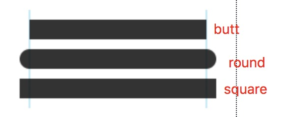
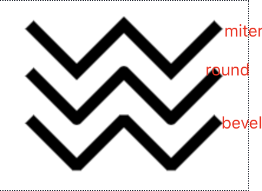
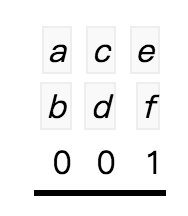

# HTML Canvas 2D Context

[英文原版地址](https://www.w3.org/TR/2dcontext/#pixel-manipulation)

## 摘要

该规范定义了 HTML canvas 元素的 2D 上下文。2D 上下文提供对象，方法和属性，以在画布绘图表面上绘制和操纵图形。

## 本文件的状态

略...

## 目录

1. [符合标准](#符合标准)
2. [canvas状态](#canvas状态)
3. [线样式](#线样式)
4. [文本样式](#文本样式)
5. [建立路径](#建立路径)
6. [变换](#变换)
7. [2D渲染上下文的图像源](#t2D渲染上下文的图像源)
8. [填充和描边样式](#填充和描边样式)
9. [在画布上绘制矩形](#在画布上绘制矩形)
10. [在画布上绘制文字](#在画布上绘制文字)
11. [在画布上绘制路径](#在画布上绘制路径)
12. [在画布上绘制图像](#在画布上绘制图像)
13. [热区](#热区)
14. [像素操作](#像素操作)
15. [合成](#合成)
16. [阴影](#阴影)
17. [绘制模型](#绘制模型)
18. [最佳实践](#最佳实践)
19. [例子](#例子)


## 符合标准
该规范是 HTML 规范。 HTML5 核心规范中描述的所有一致性要求，一致性类，定义，依赖项，术语和印刷约定均适用于此规范。

接口是根据[Web IDL](https://www.w3.org/TR/WebIDL-1/)定义的。

该规范定义了 2d 上下文类型，其 2D API 使用[CanvasRenderingContext2D](https://www.w3.org/TR/2dcontext/#canvasrenderingcontext2d)接口实现。

当 [canvas](https://html.spec.whatwg.org/multipage/canvas.html#the-canvas-element) 元素的 [getContext()](https://html.spec.whatwg.org/multipage/canvas.html#dom-canvas-getcontext) 方法返回 contextId 2d 的新对象时，用户代理必须返回一个新的 CanvasRenderingContext2D 对象。任何其他参数都将被忽略。

2D 上下文采用笛卡尔坐标系，其原点（0,0）位于左上角，坐标空间的 x 值在向右时增加，而 y 值在向下时增加。

IDL定义：

```
typedef (HTMLImageElement or
         HTMLVideoElement or
         HTMLCanvasElement) CanvasImageSource;

interface CanvasRenderingContext2D {

  // back-reference to the canvas
  readonly attribute HTMLCanvasElement canvas;

  // state
  void save(); // push state on state stack
  void restore(); // pop state stack and restore state

  // transformations (default: transform is the identity matrix)
  void scale(unrestricted double x, unrestricted double y);
  void rotate(unrestricted double angle);
  void translate(unrestricted double x, unrestricted double y);
  void transform(unrestricted double a, unrestricted double b, unrestricted double c, unrestricted double d, unrestricted double e, unrestricted double f);
  void setTransform(unrestricted double a, unrestricted double b, unrestricted double c, unrestricted double d, unrestricted double e, unrestricted double f);

  // compositing
           attribute unrestricted double globalAlpha; // (default: 1.0)
           attribute DOMString globalCompositeOperation; // (default: "source-over")

  // colors and styles (see also the CanvasDrawingStyles interface)
           attribute (DOMString or CanvasGradient or CanvasPattern) strokeStyle; // (default: "black")
           attribute (DOMString or CanvasGradient or CanvasPattern) fillStyle; // (default: "black")
  CanvasGradient createLinearGradient(double x0, double y0, double x1, double y1);
  CanvasGradient createRadialGradient(double x0, double y0, double r0, double x1, double y1, double r1);
  CanvasPattern createPattern(CanvasImageSource image, [TreatNullAs=EmptyString] DOMString repetition);

  // shadows
           attribute unrestricted double shadowOffsetX; // (default: 0)
           attribute unrestricted double shadowOffsetY; // (default: 0)
           attribute unrestricted double shadowBlur; // (default: 0)
           attribute DOMString shadowColor; // (default: "transparent black")

  // rects
  void clearRect(unrestricted double x, unrestricted double y, unrestricted double w, unrestricted double h);
  void fillRect(unrestricted double x, unrestricted double y, unrestricted double w, unrestricted double h);
  void strokeRect(unrestricted double x, unrestricted double y, unrestricted double w, unrestricted double h);

  // path API (see also CanvasPathMethods)
  void beginPath();
  void fill();
  void stroke();
  void drawFocusIfNeeded(Element element);
  void clip();
  boolean isPointInPath(unrestricted double x, unrestricted double y);

  // text (see also the CanvasDrawingStyles interface)
  void fillText(DOMString text, unrestricted double x, unrestricted double y, optional unrestricted double maxWidth);
  void strokeText(DOMString text, unrestricted double x, unrestricted double y, optional unrestricted double maxWidth);
  TextMetrics measureText(DOMString text);

  // drawing images
  void drawImage(CanvasImageSource image, unrestricted double dx, unrestricted double dy);
  void drawImage(CanvasImageSource image, unrestricted double dx, unrestricted double dy, unrestricted double dw, unrestricted double dh);
  void drawImage(CanvasImageSource image, unrestricted double sx, unrestricted double sy, unrestricted double sw, unrestricted double sh, unrestricted double dx, unrestricted double dy, unrestricted double dw, unrestricted double dh);

  // hit regions
  void addHitRegion(HitRegionOptions options);
  void removeHitRegion(DOMString id);
  void clearHitRegions();

  // pixel manipulation
  ImageData createImageData(unrestricted double sw, unrestricted double sh);
  ImageData createImageData(ImageData imagedata);
  ImageData getImageData(double sx, double sy, double sw, double sh);
  void putImageData(ImageData imagedata, double dx, double dy);
  void putImageData(ImageData imagedata, double dx, double dy, double dirtyX, double dirtyY, double dirtyWidth, double dirtyHeight);
};
CanvasRenderingContext2D implements CanvasDrawingStyles;
CanvasRenderingContext2D implements CanvasPathMethods;

[NoInterfaceObject]
interface CanvasDrawingStyles {
  // line caps/joins
           attribute unrestricted double lineWidth; // (default: 1)
           attribute DOMString lineCap; // "butt", "round", "square" (default: "butt")
           attribute DOMString lineJoin; // "round", "bevel", "miter" (default: "miter")
           attribute unrestricted double miterLimit; // (default: 10)

  // dashed lines
  void setLineDash(sequence<unrestricted double> segments); // (default: empty)
  sequence<unrestricted double> getLineDash();
           attribute unrestricted double lineDashOffset;


  // text
           attribute DOMString font; // (default: "10px sans-serif")
           attribute DOMString textAlign; // "start", "end", "left", "right", "center" (default: "start")
           attribute DOMString textBaseline; // "top", "hanging", "middle", "alphabetic", "ideographic", "bottom" (default: "alphabetic")
};

[NoInterfaceObject]
interface CanvasPathMethods {
  // shared path API methods
  void closePath();
  void moveTo(unrestricted double x, unrestricted double y);
  void lineTo(unrestricted double x, unrestricted double y);
  void quadraticCurveTo(unrestricted double cpx, unrestricted double cpy, unrestricted double x, unrestricted double y);
  void bezierCurveTo(unrestricted double cp1x, unrestricted double cp1y, unrestricted double cp2x, unrestricted double cp2y, unrestricted double x, unrestricted double y);
  void arcTo(unrestricted double x1, unrestricted double y1, unrestricted double x2, unrestricted double y2, unrestricted double radius); 
  void rect(unrestricted double x, unrestricted double y, unrestricted double w, unrestricted double h);
  void arc(unrestricted double x, unrestricted double y, unrestricted double radius, unrestricted double startAngle, unrestricted double endAngle, optional boolean counterclockwise = false); 

  };

interface CanvasGradient {
  // opaque object
  void addColorStop(double offset, DOMString color);
};

interface CanvasPattern {
  // opaque object
};

interface TextMetrics {
  readonly attribute double width;
};

dictionary HitRegionOptions {
  // dictionary to allow expansion on Hit Regions in Canvas Context 2D Level 2
  DOMString id = "";
  // for control-backed regions:
  Element? control = null;
};

interface ImageData {
  readonly attribute unsigned long width;
  readonly attribute unsigned long height;
  readonly attribute Uint8ClampedArray data;
};
```

`context.canvas` 属性必须返回在当前上下文上绘制的 canvas 元素。

除非另有说明，否则对于 2D 上下文接口，任何带有数值参数（其值为无穷大或 NaN 值）的方法调用都必须被忽略。

每当在此 API 中将 CSS 值 [currentColor](https://www.zhangxinxu.com/wordpress/2014/10/currentcolor-css3-powerful-css-keyword/) 用作颜色时，currentColor 是该元素的 color 计算值，如果在特定情况下 color 属性的计算值未定义，currentColor 关键字是完全不透明的黑色。

如果是 CanvasGradient 上的 addColorStop() 方法，用于确定 currentColor 关键字的计算值的“'color'属性的计算值”始终是完全不透明的黑色（因为没有相关的元素）。

> NOTE: 这是因为 CanvasGradient 对象与画布无关,由一个画布创建的 CanvasGradient 对象可以被另一个画布使用，因此，在指定颜色时无法知道哪个是“相关元素”。

> NOTE: 与字体相关的属性也存在类似的问题。这些规则将在下面的相关部分中详细介绍。

## canvas状态

每个上下文维护一堆绘图状态。绘图状态（Drawing states）包括：

* 当前的[变换矩阵](https://www.w3.org/TR/2dcontext/#transformations)。
* 当前的[裁剪区域](https://www.w3.org/TR/2dcontext/#clipping-region)。
* 以下属性的当前值：`strokeStyle`，`fillStyle`，`globalAlpha`，`lineWidth`，`lineCap`，`lineJoin`，`miterLimit`，`shadowOffsetX`，`shadowOffsetY`，`shadowBlur`，`shadowColor`，`globalCompositeOperation`，`font`，`textAlign`，`textBaseline`。

> NOTE: 当前路径和当前位图不属于绘图状态。当前路径是持久路径，只能使用 beginPath() 方法进行重置。当前位图是画布的属性，而不是上下文。

> NOTE: 
context.save() 将当前状态压入堆栈。
context.restore() 在栈顶弹出状态，将上下文恢复到该状态。

`save()`方法必须将当前图形状态的副本推入图形状态堆栈。
`restore()`方法必须在绘图状态堆栈中弹出顶部条目，并重置其描述的绘图状态。如果没有保存状态，则该方法将不执行任何操作。

## 线样式

> NOTE

> context.[lineWith](#lineWith)[ = value ]
返回当前线宽。
lineWidth 属性以坐标空间单位给出线的宽度。获取时，它必须返回当前值。零，负，无限和NaN值将被忽略。
默认值是`1.0`。

> context.[lineCap](#lineCap)[ = value ]
返回当前的线帽样式。
可能的值为 “butt”，“round” 和 “square”。其他值将被忽略。
默认值是`butt`。

> context.[lineJoin](#lineJoin)[ = value ]
返回当前的线连接样式。
可能的线连接样式为 “bevel”，“round” 和 “miter”。其他值将被忽略。
默认值是`miter`。

> context.[miterLimit](#miterLimit)[ = value ]
返回当前的斜接极限比率。
可以设置，以更改斜接极限比。零，负，无限和NaN值必须忽略。
当`lineJoin`属性的值为 “miter” 时，描边将使用斜接限制比率来决定如何渲染连接。可以使用`miterLimit`属性显式设置斜接极限比率。
默认值是`10.0`。

> context.[setLineDash](#setLineDash)(segments)
设置当前线的虚线图案（在描边时使用）。
该参数是距离的数组，距离要交替显示。

> segments = context.[getLineDash](#getLineDash)()
返回当前线交替类型的副本。
返回的数组将始终具有偶数个条目（即模式已规范化）。

> context.[lineDashOffset](#lineDashOffset)[ = value ]
返回相位偏移（以与 line dash pattern 相同的单位）。
可以设置，以更改相位偏移。不是有限值的值将被忽略。
默认值是`0.0`。

实现 [CanvasDrawingStyles](https://www.w3.org/TR/2dcontext/#canvasdrawingstyles) 接口的对象具有控制对象如何处理线的属性和方法。

**lineCap:**


**lineJoin:**


每个 CanvasDrawingStyles 对象都有一个 **dash list** 列表，该 **dash list** 可以为空或由偶数个非负数组成。**dash list** 初始值为空数组。

调用`setLineDash()`方法时，它必须运行以下步骤：
1. 令`a`为作为提供的参数数组的副本。
2. 如果数组中包含 Infinity、NaN、负数，则终止此步骤（不会抛出异常；用户代理可能会在开发人员控制台上显示一条消息，因为这将有助于调试）。
3. 如果`a`中元素的数量为奇数，则令`a`为`a`的两个副本的串联。
4. 设置 **dash list** 为`a`。

代码描述：
```js
var dataList;
function setLineDash(a) {
  var isErrorValue = a.some(value => value === Infinity || value !== value || value < 0);
  if (isErrorValue) {
    console.warn('数据不合法！');
    return;
  }
  if (a.length % 2 !== 0) {
    a = a.concat(a);
  }
  dataList = a;
}
```

当调用`getLineDash()`方法时，它必须以相同的顺序返回一个新创建的 **dash list** 数组。

有时更改虚线图案的“phase（相位）”很有用。例如实现“行军蚁”的效果。可以使用`lineDashOffset`属性设置相位。

当用户代理要跟踪实现`CanvasDrawingStyles`接口的路径时，它必须运行以下算法。该算法返回新路径。
1. 令`path`为要跟踪的路径的副本。
2. 干掉路径中所有`长度为零`的线段。
3. 从路径中删除任何不包含线的子路径（即只有一个点的子路径）。
4. Replace each point in each subpath of path other than the first point and the last point of each subpath by a join that joins the line leading to that point to the line leading out of that point, such that the subpaths all consist of two points (a starting point with a line leading out of it, and an ending point with a line leading into it), one or more lines (connecting the points and the joins), and zero or more joins (each connecting one line to another), connected together such that each subpath is a series of one or more lines with a join between each one and a point on each end.
5. 向连接该子路径的最后一点和第一个点的路径中的每个闭合子路径添加一条直线闭合线；将最后一点更改为联接(从先前的最后一条线到新添加的闭合线)，并将第一个点更改为联接（从新添加的闭合线到第一条线）。
6. 如果 **dash list** 为空，请跳至标有“转换”的步骤。
7. 设`pattern width`为`dash list`列表中所有条目的串联，以坐标空间单位表示。
8. 对于路径中的每个子路径，运行以下子步骤。这些子步骤会改变路径中的子路径。
    1. 设子路径宽度为子路径所有线的长度，以坐标空间单位为单位。 
    2. 设`offset`为样式`lineDashOffset`的值，以坐标空间单位为单位。
    3. 当偏移量`offset`大于`pattern width`时，将其按`pattern width`减小。
    4. 将`L`定义为沿子路径中所有线定义的线性坐标线，这样子路径中第一条线的开始被定义为坐标0，子路径中最后一条线的结束被定义为坐标子路径宽度。
    5. 设置`position = 0 - offset`。
    6. 设置`index = 0`。
    7. 让当前状态`current state`为关闭（其他状态为打开且为零打开）。
    8. **Dash on**：使段长度`segment length`为样式划线列表`styles dash list`的第`index`个条目的值。
    9. 按段长度`segment length`递增位置`position`。
    10. 如果位置`position`大于子路径宽度`subpath width`，然后结束此子路径的这些子步骤，并为下一个子路径再次启动它们；如果没有更多子路径，然后跳到标有“转换”的步骤。
    11. 如果段长度`segment length`不为零，则打开当前状态`current state`。
    12. `index++`。
    13. **Dash off**：使段长度`segment length`为样式划线列表`styles dash list`的第`index`个条目的值。
    14. 令`start`为`L`上的偏移位置`position`。
    15. 按段长度`segment length`递增位置`position`。
    16. 如果位置`position`小于零，则跳至标记为后切的步骤。
    17. 如果`start`小于零，则将`start`设为零。
    18. 如果`position`大于子路径宽度`subpath width`，则使`end`为`L`上的偏移子路径宽度`subpath width`。否则，使`end`为`L`上的偏移位置`position`。
    19. 根据需要运行以下子步骤之一：
        * **如果段长度`segment length`为零且当前状态`current state`为关闭`off`**
        什么也不做，只要继续下一步即可。
        * **如果当前状态`current state`为关闭`off`**
        Cut the line on which end finds itself short at end and place a point there, cutting its containing subpath in two; remove all line segments, joins, points, and subpaths that are between start and end; and finally place a single point at start with no lines connecting to it.
        The point has a directionality for the purposes of drawing line caps (see below). The directionality is the direction that the original line had at that point (i.e. when L was defined above).
        * **除此以外**
        Cut the line on which start finds itself into two at start and place a point there, cutting the subpath that it was in in two, and similarly cut the line on which end finds itself short at end and place a point there, cutting the subpath that it was in in two, and then remove all line segments, joins, points, and subpaths that are between start and end.
        If start and end are the same point, then this results in just the line being cut in two and two points being inserted there, with nothing being removed, unless a join also happens to be at that point, in which case the join must be removed.
    20. 剪切后`Post-cut:`：如果位置`position`大于子路径宽度`subpath width`，则跳至标有“转换”的步骤。
    21. 如果线段长度`segment length`大于零，则使“在虚线处定位”`positioned-at-on-dash`为假。
    22. `index++`。如果它等于样式`dash list`列表中的条目数，则使`index`为`0`。
    23. 跳到第`8`步，`Dash on`。
9. 转换`Convert`：这是将路径转换为代表其笔划`stroke`的新路径的步骤。
创建一条描述区域边缘的新路径，区域将被覆盖，如果一条直线的长度等于`lineWidth`，且沿路径中的每个路径扫过，同时保持一定角度，以使直线与扫掠路径正交，将每个点替换为满足样式`lineCap`属性所必需的端盖，如前所述并在下面进行详细说明，并用满足样式`lineJoin`类型所需的联接替换每个联接，定义如下。

    **Caps**：每个点都有一个垂直于从其中出来的线的方向的平坦边缘。根据样式`lineCap`的值对它们进行扩充。“`butt`”值表示未添加任何额外的线宽。“`round`”值意味着必须将直径等于样式`lineWidth`宽度的半圆附加放置在从每个点出来的线上。“`square`”值表示矩形，其长度为样式`lineWidth`宽度，宽度为样式`lineWidth`的一半，垂直于从点出线的方向垂直于边缘放置，必须在每个点添加。

    没有线的点必须背对背放置两个顶盖，就好像两个点实际上是沿点的方向性（如上定义）通过一条无限短的直线相互连接。

    **Joins**：除了连接发生的点外，每个联接都有两个额外的要点，一个针对每条线：发现两个角距连接点的线宽的一半；一个垂直于每条线，每条线都离另一条线最远。

    必须在所有联接处添加一个实心三角形，将这两个相对的角用一条直线连接，并将三角形的第三点作为联接点。 `lineJoin`属性控制是否呈现任何其他内容。 上述三个值的含义如下：

    “`bevel`”值表示这是在联接时渲染的所有内容。
    “`round`”值表示必须添加一个连接圆弧的两个圆角，该圆弧邻接（但不重叠）上述    三角形，并且直径等于线宽和连接点的原点 在加入。
    “`miter`”值表示必须在连接处添加第二个填充的三角形（如果可以给出斜接长度）    ，其中一条线是上述两个角之间的线，邻接第一个三角形，另外两个是连续的 只要在    不超过斜接长度的情况下相交即可，只要两条连接线的外边缘的长度相等即可。
    
    斜接长度是从连接发生点到连接外部线边缘的交点的距离。 斜接极限比是斜接长度与    线宽一半的最大允许比率。 如果斜接长度会导致超出斜接限制比率（由样式    `miterLimit`属性设置），则不得添加第二个三角形。
    
    无论路径在路径中的方向如何，新创建的路径中的子路径都必须顺时针缠绕。

10. 返回新创建的路径。

## 文本样式

> NOTE

> context.[font](#font) [ = value ]
返回当前字体设置。
可以设置更改字体。语法与 CSS [font](https://developer.mozilla.org/zh-CN/docs/Web/CSS/font) 属性的语法相同。无法解析为 CSS 字体值的值将被忽略。
相对关键字和长度值是相对于 canvas 元素的字体计算的。
默认值`10px sans-serif`。

> context.[textAlign](#textAlign) [ = value ]
返回当前的文本对齐设置。
可以设置，更改对齐方式。可能的值为“`start`”，“`end`”，“`left`”，“`right`”和“`center`”。其他值将被忽略。默认值为“`start`”。

> context.[textBaseline](#textBaseline) [ = value ]
返回当前基线对齐设置。
可以设置，以更改基线对齐方式。可能的值 "`top`", "`hanging`", "`middle`", "`alphabetic`", "`ideographic`", or "`bottom`",。其他值将被忽略。默认为“`alphabetic`”。

设置`font`时，必须以与CSS的'font'属性相同的方式解析字体（但不支持与属性无关的样式表语法，例如'inherit'），并且必须将生成的字体分配给上下文， '`line-height`'组件被强制为'`normal`'，'`font-size`'组件被转换为CSS像素，并且系统字体被计算为显式值。 如果新值在语法上不正确（包括使用与属性无关的样式表语法，如“inherit”或“initial”），则必须忽略它，而无需分配新的字体值。

使用字体时，必须在字体样式源节点`font style source node's`的样式表的上下文中解释字体名称；因此，一旦加载，使用`@font-face`嵌入的，对该元素可见的任何字体都必须可用。

用户代理只能使用矢量字体；如果用户代理使用位图字体，则转换可能会使字体看起来非常难看。

获取时，`font`属性必须返回上下文当前字体的序列化形式（不包含“line-height”组件）。

`textBaseline`属性的允许关键字对应于字体中的对齐点：


## 建立路径

每个实现 [CanvasPathMethods](https://www.w3.org/TR/2dcontext/#canvaspathmethods) 接口的对象都有一个路径。路径具有零个或多个子路径的集合。每个子路径包含一个或多个点的集合，这些点由直线或曲线连接，并有指示子路径是否闭合的标志。闭合子路径是通过直线将子路径的最后一点连接到子路径的第一点的路径。绘制路径时，少于两个点的子路径将被忽略。

创建实现 CanvasPathMethods 接口的对象时，其路径必须初始化为零个子路径。

> NOTE

> context.[moveTo](#moveTo)(x, y)
  用给定的点创建一个新的子路径。

> context.[closePath](#closePath)()
  将当前子路径标记为已关闭，并以与新关闭的子路径的起点和终点相同的点开始一个新的子路径。

> context.[lineTo](#lineTo)(x, y)
  将给定点添加到当前子路径，该子路径通过一条直线连接到前一个子路径。

> context.[quadraticCurveTo](#quadraticCurveTo)(cpx, cpy, x, y)
  将给定点添加到当前子路径，该子路径通过具有给定控制点的二次Bézier曲线与上一个子路径连接。

> context.[bezierCurveTo](#bezierCurveTo)(cp1x, cp1y, cp2x, cp2y, x, y)
  将给定点添加到当前子路径，该子路径通过带有给定控制点的三次贝塞尔曲线与前一条路径连接。

> context.[arcTo](#arcTo)(x1, y1, x2, y2, radius)
  将具有给定控制点和半径的圆弧添加到当前子路径，并通过一条直线连接到上一个点
  如果给定的半径为负数，则抛出`IndexSizeError`异常。

> context.[arc](#arc)(x, y, radius, startAngle, endAngle [, counterclockwise(逆时针) ])
  将点添加到子路径，以便将由自变量描述的圆的圆周描述的弧从给定的起始角度开始，以给定的终止角度终止，并沿给定方向（默认为顺时针）添加到 通过一条直线连接到上一点的路径。
  从正x轴顺时针以弧度为单位，对应此圆的圆周的`startAngle`和`endAngle`的点。
  如果给定的半径为负数，则抛出`IndexSizeError`异常。

> context.[rect](#rect)(x, y, w, h)
  向该路径添加一个新的闭合子路径，代表给定的矩形。

  

<a id="变换"></a>

## 变换（Transformations）

每个`CanvasRenderingContext2D`对象都有一个当前的转换矩阵，以及操作方法（在本节中介绍）。创建`CanvasRenderingContext2D`对象时，必须将其变换矩阵初始化为恒等变换。

当创建当前路径时，转换矩阵将应用于坐标，以及在`CanvasRenderingContext2D`对象上绘制文本，形状和路径时。

转换必须以相反的顺序执行。

> NOTE：
context.[scale](#scale)(x, y)
更改变换矩阵以应用具有给定特征的缩放变换。
context.[rotate](#rotate)(angle)
更改变换矩阵以应用具有给定特征的旋转变换。角度以弧度为单位，顺时针方向。
context.[translate](#translate)(x, y)
更改变换矩阵以应用具有给定特征的平移变换。
context.[transform](#transform)(a, b, c, d, e, f)
如下所述，更改变换矩阵以应用由参数指定的矩阵。
用将当前变换矩阵与以下描述的矩阵相乘的结果来替换当前变换矩阵：
context.[setTransform](#setTransform)(a, b, c, d, e, f)
如下所述将转换矩阵更改为参数指定的矩阵。
将当前变换重置为单位矩阵，然后使用相同的参数调用`transform（a，b，c，d，e，f）`方法。



<a id="t2D渲染上下文的图像源"></a>

## 2D渲染上下文的图像源

此联合类型允许实现以下任何接口的对象用作图像源：

* [HTMLImageElement](https://html.spec.whatwg.org/multipage/embedded-content.html#htmlimageelement)([img](https://html.spec.whatwg.org/multipage/embedded-content.html#the-img-element) elements)

* [HTMLVideoElement](https://html.spec.whatwg.org/multipage/embedded-content.html#htmlvideoelement)([video](https://html.spec.whatwg.org/multipage/embedded-content.html#the-video-element) elements)

* [HTMLCanvasElement](https://html.spec.whatwg.org/multipage/embedded-content.html#htmlcanvaselement)([canvas](https://html.spec.whatwg.org/multipage/embedded-content.html#the-canvas-element) elements)

当需要用户代理检查 image 参数的可用性时，其中 image 是 [CanvasImageSource](https://www.w3.org/TR/2dcontext/#canvasimagesource) 对象，则用户代理必须运行以下步骤，这些步骤返回好，坏或中止：

1. 如果 _image_ 参数是处于断开 [broken](https://html.spec.whatwg.org/multipage/images.html#img-error) 状态的`HTMLImageElement`对象，则引发 [InvalidStateError](https://www.w3.org/TR/WebIDL-1/#invalidstateerror) 异常，返回 _aborted_，然后终止这些步骤。

2. 如果 _image_ 参数是无法完全解码 [fully decodable](https://html.spec.whatwg.org/multipage/images.html#img-good) 的`HTMLImageElement`对象，或者，如果 _image_ 参数是一个 [readyState](https://html.spec.whatwg.org/multipage/media.html#dom-media-readystate) 属性为`HAVE_NOTHING`或`HAVE_METADATA`的`HTMLVideoElement`对象，则返回 _bad_ 并中止这些步骤。

3. 如果 _image_ 参数是一个`HTMLImageElement`对象，其固有宽度或固有高度（或两者）等于零，然后返回 _bad_ 并中止这些步骤。

4. 如果 _image_ 参数是一个`HTMLCanvasElement`对象，其水平尺寸或垂直尺寸等于零，然后返回 _bad_ 并中止这些步骤。

5. 返回 _good_。

当`CanvasImageSource`对象表示`HTMLImageElement`时，必须将元素的图像用作源图像。

具体来说，当`CanvasImageSource`对象表示`HTMLImageElement`中的动画图像时，用户代理必须使用动画的默认图像（当不支持或禁用动画时，将使用格式定义的图像），如果没有此类图像，则为`CanvasRenderingContext2D API`渲染图像时的第一帧。

当`CanvasImageSource`对象表示`HTMLVideoElement`时，为`CanvasRenderingContext2D API`渲染图像时，在调用带有参数的方法时，当前回放位置处的帧必须用作源图像。并且源图像的尺寸必须是媒体资源的固有宽度和固有高度（即在应用任何长宽比校正之后）。

当`CanvasImageSource`对象表示`HTMLCanvasElement`时，必须将元素的位图用作源图像。

**The image argument is not origin-clean** 如果它是一个`HTMLImageElement`或`HTMLVideoElement`，其起源 [origin](https://html.spec.whatwg.org/multipage/browsers.html#origin-0) 与输入设置对象 [entry settings object](https://html.spec.whatwg.org/multipage/webappapis.html#entry-settings-object) 指定的起源不同，或者它是一个`HTMLCanvasElement`，其位图的`origin-clean`标志为`false`，或者它是一个`CanvasRenderingContext2D`对象，其位图的`origin-clean`标志为`false`。

## 填充和描边样式

> NOTE：

> context.[fillStyle](#fillStyle) [ = value ]
返回用于填充形状的当前样式。
可以设置，更改填充样式。
样式可以是包含 CSS 颜色的字符串，也可以是 [CanvasGradient](https://www.w3.org/TR/2dcontext/#canvasgradient) 或[CanvasPattern](https://www.w3.org/TR/2dcontext/#canvaspattern) 对象。无效的值将被忽略。

> context.[strokeStyle](#strokeStyle) [ = value ]
返回用于描边形状的当前样式。
可以设置，以更改描边样式。
样式可以是包含 CSS 颜色的字符串，也可以是 [CanvasGradient](https://www.w3.org/TR/2dcontext/#canvasgradient) 或[CanvasPattern](https://www.w3.org/TR/2dcontext/#canvaspattern) 对象。无效的值将被忽略。


如果该值是一个字符串但不能解析为`CSS <color>`值，或者既不是字符串，也不是`CanvasGradient`或`CanvasPattern`，则必须将其忽略，并且该属性必须保留其先前的值。如果新值是标记为 [not origin-clean](https://www.w3.org/TR/2dcontext/#concept-canvas-pattern-not-origin-clean) 的`CanvasPattern`对象，则位图的`origin-clean`标志必须设置为`false`。

如果将其设置为`CanvasPattern`或`CanvasGradient`对象，则该赋值是动态的的，这意味着赋值后对该对象所做的更改确实会影响后续的描边或填充形状。

当创建上下文时， `fillStyle`和`strokeStyle`属性初始化为字符串`＃000000`。

当值是颜色时，在画布上绘制时，它一定不受变换矩阵的影响。

____

有两种类型的渐变，`线性渐变`和`径向渐变`，均由 [CanvasGradient](https://www.w3.org/TR/2dcontext/#canvasgradient) 接口实现。

创建渐变后（请参见下文），`stop`将沿着它去定义颜色如何沿渐变分布。每个停靠点的渐变颜色是为此停靠点指定的颜色。在每个这样的 stop 之间，必须在 RGBA 空间上线性内插颜色和 alpha 分量，而无需预先乘以 alpha 值即可找到要在该偏移量处使用的颜色。在第一个 stop 之前，颜色必须是第一个 stop 的颜色。最后一站之后，颜色必须是最后一站的颜色。没有停靠点时，渐变为透明黑色。

> CanvasGradient：

> gradient.[addColorStop](#addColorStop)(offset, color)
将具有给定颜色的色标添加到给定偏移处的渐变中。0.0是渐变一端的偏移，1.0是另一端的偏移。
如果偏移量超出范围，则抛出`IndexSizeError`异常。如果无法解析颜色，则引发`SyntaxError`异常。

> gradient = context.[createLinearGradient](#createLinearGradient)(x0, y0, x1, y1)
返回一个`CanvasGradient`对象，该对象表示一个线性渐变，该渐变沿着参数所表示的坐标所给出的线进行绘制。

> gradient = context.[createRadialGradient](#createRadialGradient)(x0, y0, r0, x1, y1, r1)
返回一个`CanvasGradient`对象，该对象表示一个径向渐变，该渐变沿自变量表示的圆所给定的圆锥形绘制。
如果两个半径之一为负，则抛出`IndexSizeError`异常。

`createRadialGradient（x0，y0，r0，x1，y1，r1）`方法采用六个参数，前三个代表圆心为（x0，y0）和半径为 r0 的起始圆，最后三个代表圆心为（x1，y1）和半径r1 的终点圆。这些值以坐标空间单位为单位。如果 r0 或 r1 均为负，则必须抛出`IndexSizeError`异常。否则，该方法必须返回以两个指定的圆初始化的径向`CanvasGradient`。

必须按照以下步骤绘制径向渐变：

1. 如果`x0 = x1`且`y0 = y1`且`r0 = r1`，则径向渐变不得绘制任何内容。终止这些步骤。
2. 令`x(ω) = (x1 - x0)ω + x0`
   令`y(ω) = (y1 - y0)ω + y0`
   令`r(ω) = (r1 - r0)ω + r0`
   令 ω 处的颜色为渐变上该位置处的颜色（颜色来自上述内插和外推）。
3. 对于所有 ω 值，其中`r(ω）> 0`，从最接近正无穷大的 ω 值开始，到最接近负无穷大的 ω 值结束，在位置`(x(w)，y(w))`绘制半径为`r(ω)`的圆的圆周的颜色为 ω，但只能在此步骤中用于此渐变渲染的画布上尚未被较早的圆圈绘制的部分上绘制。

然后，在渲染时，必须按照当前变换矩阵的描述对所得的径向渐变进行变换。

仅在相关的描边或填充效果要求绘制渐变时，才必须绘制渐变。

_____

模式`Patterns`由实现不透明 [CanvasPattern](https://www.w3.org/TR/2dcontext/#canvaspattern) 接口的对象表示。

> NOTE：
pattern = context.[createPattern](#createPattern)(image, repetition)
返回一个 [CanvasPattern](https://www.w3.org/TR/2dcontext/#canvaspattern) 对象，该对象使用给定的图像并在重复参数`repetition`给出的方向上重复。
允许的重复值是`repeat`（两个方向），`repeat-x`（仅水平），`repeat-y`（仅垂直）和`no-repeat`（都不是）。如果重复参数为空，则使用重复值。
如果图像没有图像数据，则抛出`InvalidStateError`异常。如果第二个参数不是允许的值之一，则抛出`SyntaxError`异常。如果图像尚未完全解码，则该方法返回`null`。

## 在画布上绘制矩形

## 在画布上绘制文字
## 在画布上绘制路径
## 在画布上绘制图像
## 热区
## 像素操作
## 合成
## 阴影
## 绘制模型
## 最佳实践
## 例子

## 参考

[canvasapi](https://www.canvasapi.cn/)